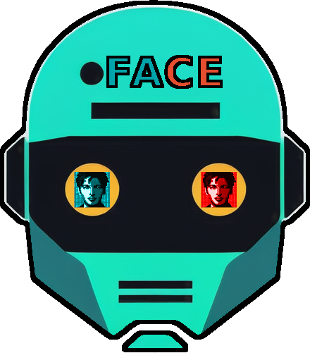

  

# Facial Analysis and Comparison Engine (FACE)

<p align="center">
  
</p>


  

## Description

This project involves the usage of flask to serve the UI and the insightface library in order to recognize faces and calculate similarity.
Additionally it incorporates the usage of a family classifier to calculate the probability for two provided faces to be of relatives.
  

### Features

- [x] Upload images to the server
- [x] Compare two images and get evaluated similarityT
- [x] Find most similar image from database
- [x] Evaluate probability of two people being related
- [x] Template Matching
- [x] Parameter tuning
- [x] Batch upload through url or zip
- [x] Create similarity clusters to identify people across many images

## Installation

### Prerequisites

Before you begin, ensure you have the following installed:

- Python 3.x , 3.10-3.12 recommended

- [Pip](https://pip.pypa.io/en/stable/installation/) (Python package installer)

- [Virtualenv](https://virtualenv.pypa.io/en/latest/installation.html) (optional but recommended)

#### Windows
you may need additional dependencies such as:
- [microsoft visual c++ build tools](https://visualstudio.microsoft.com/visual-cpp-build-tools/) , make sure to choose c++ in the install wizard, it could also be installed already through visual studio

### Option 1 - Script
First, you'll need to install some Prerequisites
```bash
pip install gdown gitpython
```
  **Run as administrator if using powershell on windows**
you can use the script in [here](assets/install.py) to automatically clone both frontend and server repositories, setup all requirements with virtual enviornments and download the onnx models
### Option 2 - Manual
#### Clone the Repository

```bash

git clone https://github.com/ofekhta1/Face-Server.git

cd  Face-Server

```

  

#### Set Up Virtual Environment (Optional but Recommended)

  

Setting up a virtual environment is recommended to keep your dependencies isolated.

  
  

```bash

# Create a virtual environment

python3 -m venv venv

  

# Activate the virtual environment

# On Windows, use: venv\Scripts\activate

# On macOS and Linux, use: source venv/bin/activate

```

#### Install Dependencies

```bash

pip install -r requirements.txt

```

#### Run the Application

```bash

# Set the FLASK_APP environment variable

# On Windows, use: set FLASK_APP=app.py

# On macOS and Linux, use: export FLASK_APP=app.py

  

# Enable debug mode (optional, recommended for development)

# On Windows, use: set FLASK_ENV=development

# On macOS and Linux, use: export FLASK_ENV=development

  

python3 app.py

```

Visit `http://localhost:5057` in your web browser to access the application.

### Option 3 - Docker Container
Coming soon!